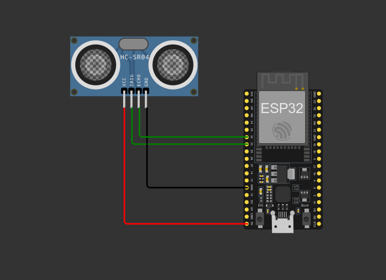
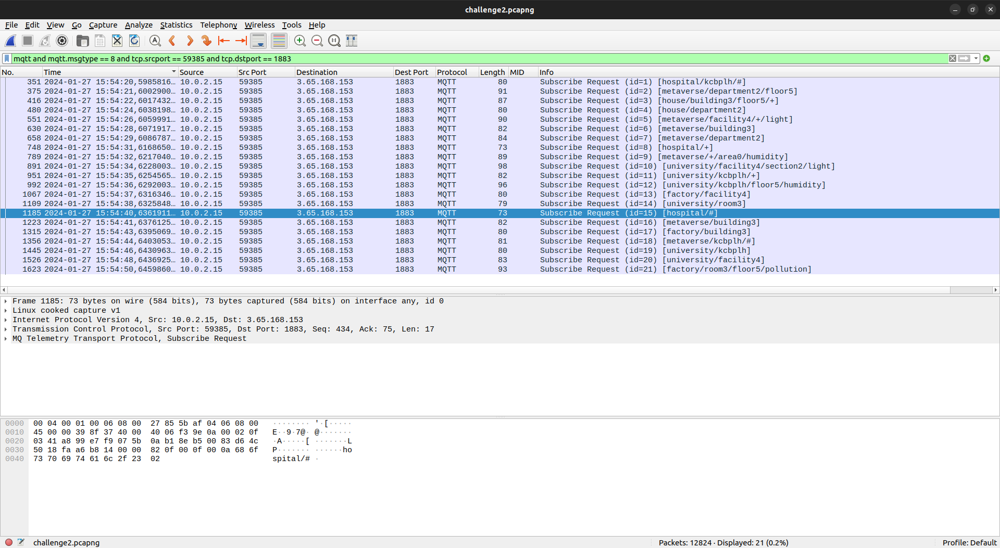
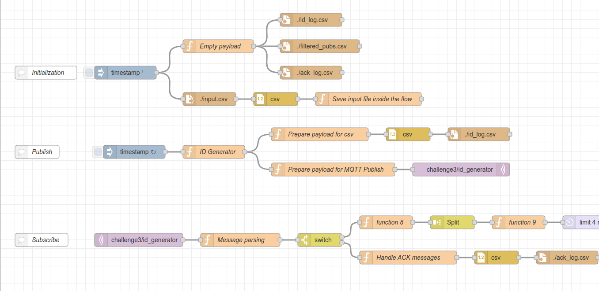

# Polimi IoT

My solutions for the challenges of the Internet of Thing course at Polimi during the academic year 2023/2024.

## Challenges

### First Challenge

The first challenge was a simple IoT system simulating a parking sensor.

The system consists of a sensor that detects the presence of a car in a parking space and then sends a message to a sink node that stores the data.



### Second Challenge

The second challenge was to analyse a Wireshark capture of CoAP/MQTT/MQTT-SN communication between multiple clients and servers.

In the end, there were some questions to answer about the packets exchanged.



### Third Challenge

The third challenge was about Node-Red and the creation of a simple flow that sends and receives data through MQTT.

Data were randomly generated and sent to a broker, then received by a subscriber and stored in CSV files.

In addition, some rules were provided to filter the data and store them in different files.

Everything was handled through Node-Red components in addition to the MQTT broker running locally with Mosquitto.



## Misc

Command to print a Jupyter notebook:

```
jupyter nbconvert --to PDF --LatexPreprocessor.title "Internet of Things - Second Challenge" --LatexPreprocessor.author_names "Francesco Pastore 10629332" "report.ipynb"
```
